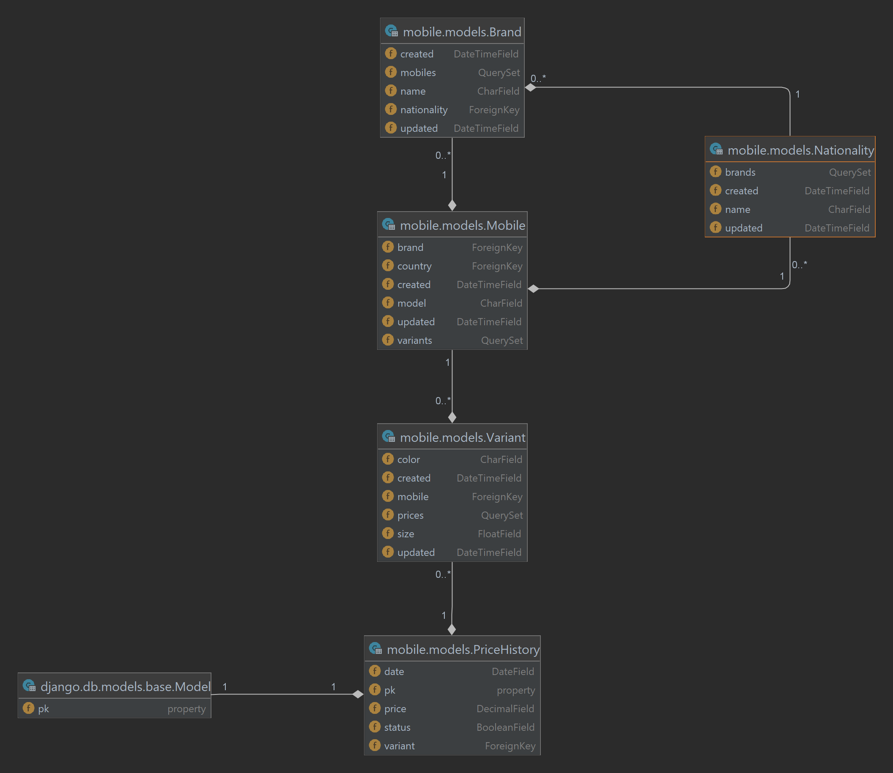

# Mobile Store Project

## Overview

This project is developed for managing the inventory of a mobile phone store. It allows for the registration of key
details for each mobile phone, such as the country of origin, model, price, color, stock status, and more. Through the
implemented Django views and DRF APIs, users can easily add new mobile phones, update existing information, and retrieve
the data they need. The system is designed to streamline inventory management, ensuring accurate and up-to-date
information for the store's mobile stock.

## Table of Contents

1. [Key Features](#key-features)
2. [Getting Started](#getting-started)
    + [Prerequisites](#prerequisites)
    + [Installation](#installation)
    + [Running the Project (with Docker)](#running-the-project-with-docker)
3. [Running the Tests](#running-the-tests)
4. [Project Structure](#project-structure)
    + [Apps](#apps)
    + [Settings](#settings)
    + [Static and Media Files](#static-and-media-files)
5. [API Specification](#api-specification)
    + [Korea Brands API](#korea-brands-api)
    + [Mobile Brands API](#mobile-brands-api)
    + [Same Nationality API](#same-nationality-api)
6. [Swagger Documentation](#swagger-documentation)
7. [Pre-commit](#pre-commit)
    + [Installation](#installation-1)
    + [Running pre-commit manually](#running-pre-commit-manually)
    + [Skipping pre-commit hooks](#skipping-pre-commit-hooks)

## Key Features

- **Django & DRF-Based**: This project is built using Django and Django REST Framework (DRF), utilizing both traditional
  Django views and DRF APIs.

- **Comprehensive Testing**: All components of the project, such as models, serializers, views, APIs, and more, have
  been thoroughly tested. Extensive test cases have been written to cover all scenarios. Continuous integration for
  tests is handled using `GitHub Actions`.

- **API Documentation with Swagger**: The project includes customized API documentation using Swagger. All error
  scenarios are fully documented, providing detailed insights into the API’s behavior.

- **Improved UI/UX**: Frontend user experience has been enhanced using HTML and CSS to ensure a smooth and responsive
  interface.

- **Pre-Commit Formatting**: Code formatting and other pre-commit tasks are handled using pre-commit hooks, ensuring
  consistency and clean code.

- **Detailed Documentation**: All aspects of the project have been thoroughly documented in both the `README.md` and
  the `docs` section, providing detailed explanations of the system's functionality.



## Getting Started

### Prerequisites

- **Python 3.11**: Ensure you have Python 3.11 installed on your system. If not, download and install it from the
  official Python website.
- **Docker**: Install Docker on your system by following the instructions provided in the official Docker documentation.

### Installation

1. Clone the project repository from GitHub:

   ```bash
   git clone https://github.com/mobinghoveoud/mobile-store.git
   cd mobile-store/src
   ```

2. Create a copy of `example.env` file and rename it to `.env`. Update the configuration values in the `.env` file
   according to your setup.

   ```bash
   copy .env.example .env
   ```

+ Example `.env` file:

   ```dotenv
   SECRET_KEY=YOUR_SECRET_KEY
   DJANGO_SETTINGS_MODULE=core.settings.local
   DB_NAME=test
   DB_USER=postgres
   DB_PASSWORD=postgres
   ```

### Running the Project (with Docker)

1. Build the Docker containers:

   ```bash
   docker-compose build
   ```

2. Start the Docker containers:

   ```bash
   docker-compose up -d
   ```

   The `-d` flag runs the container in detached mode, allowing it to run in the background.

3. Access the project at `http://localhost:80`.

## Running the Tests

You can run the tests with this command:

   ```commandline
   python manage.py test --settings=core.settings.test
   ```

## Project Structure

### Apps

The project consists of the following apps:

- **mobiles**: Handles the management of mobile brands, models, variants, and price
  histories. [(Link to Docs)](docs/mobiles/main.md)
- **api**: Provides API endpoints for mobile-related operations.

### Settings

The project has multiple settings files:

+ Development Settings
    - File: [settings/local.py](src/core/settings/local.py)
    - Configuration for the development environment.

+ Test Settings (SQLite3)
    - File: [settings/test.py](src/core/settings/test.py)
    - Configuration for the testing environment.
    - Inherits from the development settings but uses a separate test database and some test-specific settings.

+ Production Settings
    - File: [settings/production.py](src/core/settings/production.py)
    - Configuration for the production environment.

### Static and Media Files

The project uses Django's built-in static and media file handling. Static files (CSS) are stored in the `static`
directory, while media files (uploaded images) are stored in the `media` directory.

## API Specification

### Korea Brands API

#### Description

The `KoreaBrandsView` is an API view that retrieves a list of brands from Korea along with their related mobiles and
variants. The view supports an optional query parameter `flat` that, when set to 1, returns the data in a flat
representation.

#### Endpoint

```
GET /api/korea-brands/
```

#### Parameters

- `flat` (optional): Set to 1 to get the flat representation of the data.

#### Responses

- **200 OK**: Returns the list of brands from Korea along with their related mobiles, variants and prices.
- **406 Not Acceptable**: Returns an error response if the value provided for the `flat` parameter is not a valid
  integer.

### Mobile Brands API

#### Description

The `MobileBrandsView` is an API view that retrieves a list of mobiles filtered by brand names. The view requires a
mandatory query parameter `brands`, which should be a comma-separated list of brand names. The view also supports an
optional query parameter `flat` that, when set to 1, returns the data in a flat representation.

#### Endpoint

```
GET /api/mobile-brands/
```

#### Parameters

- `brands` (required): Comma-separated brand names to filter mobiles by.
- `flat` (optional): Set to 1 to get the flat representation of the data.

#### Responses

- **200 OK**: Returns the list of mobiles filtered by brand names.
- **406 Not Acceptable**: Returns an error response if the value provided for the `flat` parameter is not a valid
  integer.
- **422 Unprocessable Entity**: Returns an error response if the `brands` parameter is missing in the query.

### Same Nationality API

#### Description

The `SameNationalityView` is an API view that retrieves a list of mobiles with the same brand nationality and country.
The view supports an optional query parameter `flat` that, when set to 1, returns the data in a flat representation.

#### Endpoint

```
GET /api/same-nationality/
```

#### Parameters

- `flat` (optional): Set to 1 to get the flat representation of the data.

#### Responses

- **200 OK**: Returns the list of mobiles with the same brand nationality and country.
- **406 Not Acceptable**: Returns an error response if the value provided for the `flat` parameter is not a valid
  integer.

## Swagger Documentation

The project includes Swagger documentation for the API routes. Below are the Swagger routes and their descriptions:

1. `api/schema/`: This endpoint provides the API schema in JSON format.

2. `api/schema/swagger-ui/`: This endpoint displays the Swagger UI, allowing you to explore the API endpoints visually.

3. `api/schema/redoc/`: This endpoint displays the ReDoc UI, providing an alternative visual representation of the API
   documentation.

You can access the Swagger UI and ReDoc UI by visiting the respective URLs after running the project.

For example:

- Swagger UI: `http://localhost:80/api/schema/swagger-ui/`
- ReDoc: `http://localhost:80/api/schema/redoc/`
- Schema YML File: [schema.yml](src/schema.yml)

## Pre-commit

### Installation

1. **Install pre-commit**

   Ensure `pre-commit` is installed. If not, install it via pip:

   ```bash
   pip install -r src/requirements.txt
   ```

2. **Install pre-commit hooks for your project**

   Navigate to the root directory of your project and run:

   ```bash
   pre-commit install --hook-type pre-commit
   ```

   This sets up `pre-commit` hooks for your project.

### Running pre-commit manually

Run `pre-commit` against all files in your project:

```bash
pre-commit run --all-files -v
```

### Skipping pre-commit hooks

To skip running `pre-commit` hooks temporarily, use the `--no-verify` option when committing:

```bash
git commit --no-verify -m "Your commit message"
```
